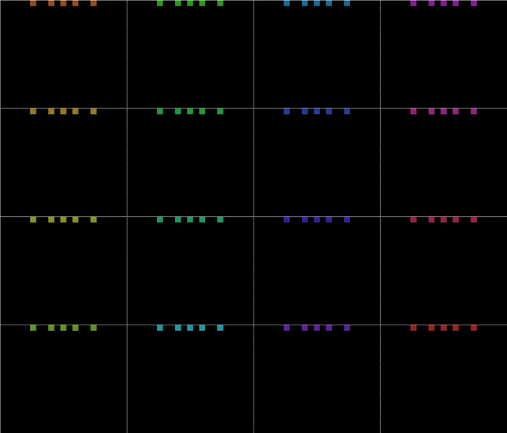
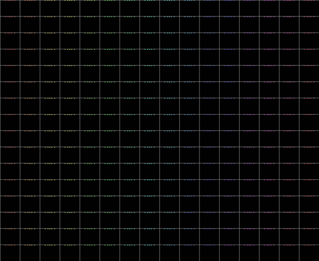

# Elementary Cellular Automata
This explores [Elementary Cellular Automata](https://en.wikipedia.org/wiki/Elementary_cellular_automaton#:~:text=In%20mathematics%20and%20computability%20theory,and%20its%20two%20immediate%20neighbors.).
You can simply open index.html in a browser, or visit the live [demo](https://8onitsside.com/demos/eca/).

There are a few configuration options to change the behaviour.

# Sources / References
- [Using a sliding window to show the animation](https://towardsdatascience.com/simple-but-stunning-animated-cellular-automata-in-python-c912e0c156a9)
- [Making gifs](https://superuser.com/questions/556029/how-do-i-convert-a-video-to-gif-using-ffmpeg-with-reasonable-quality/556031#556031)
- [Capturing canvas output](https://github.com/ippsketch/p5js-animation-to-png-template)
